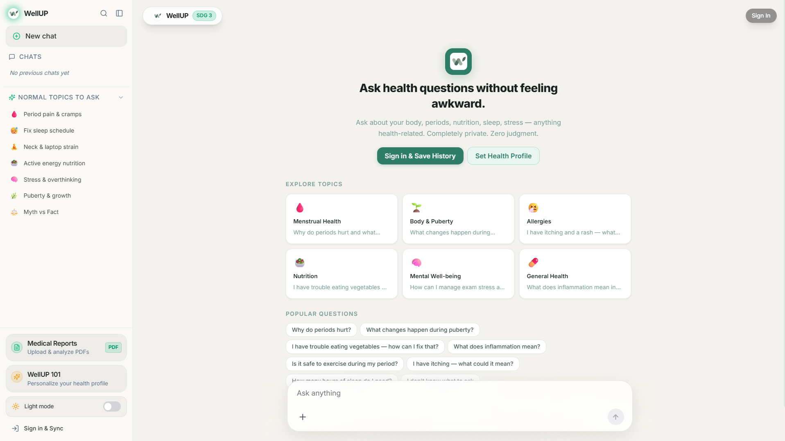
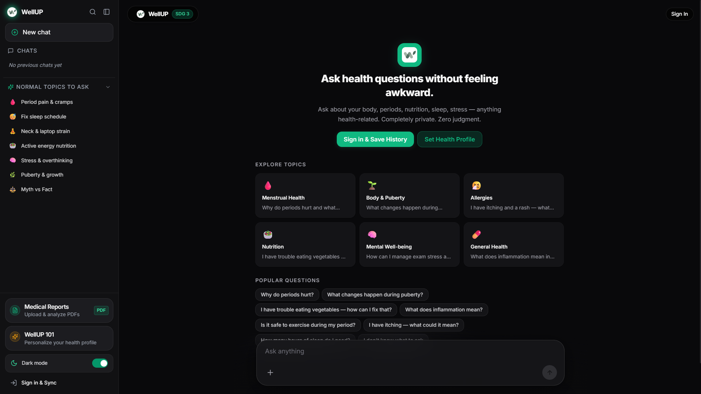
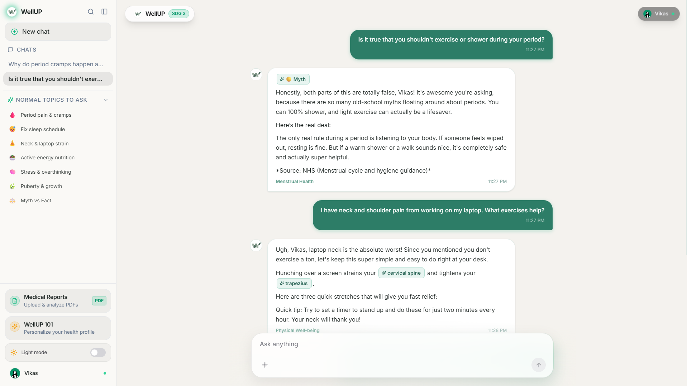
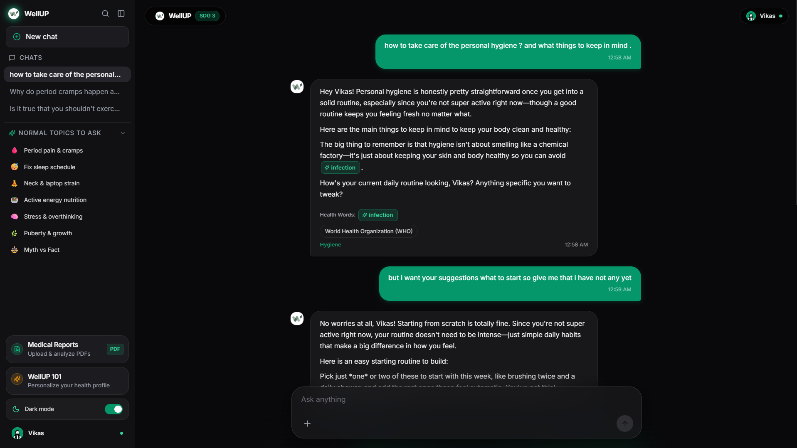
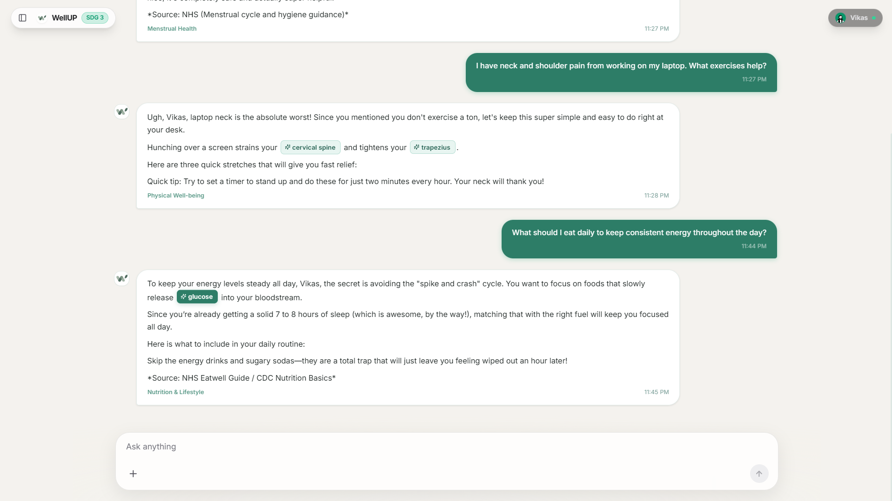
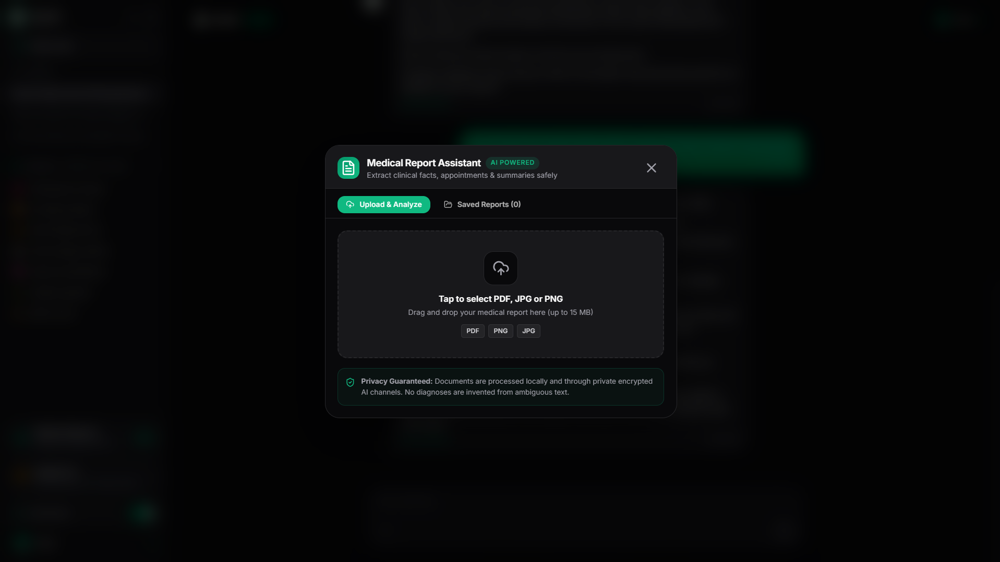
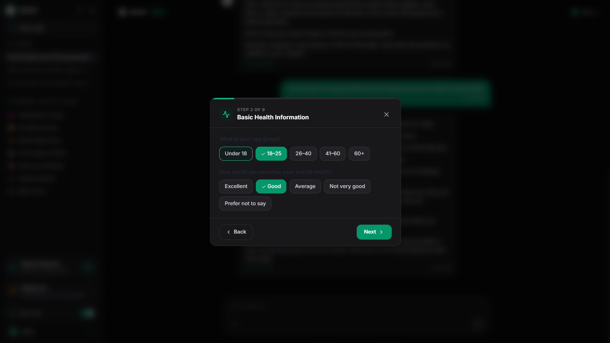
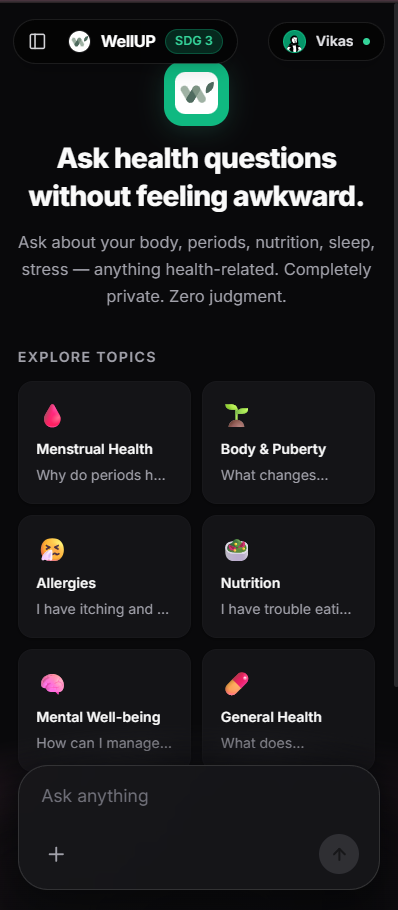
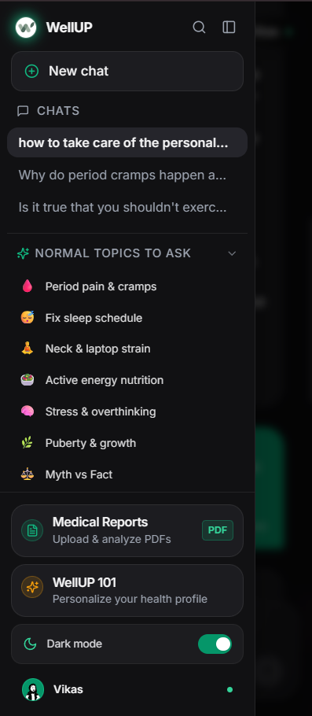

# 🌿 WellUP — Adolescent & Youth Health Awareness Platform

<div align="center">
  
  <h1>WellUP</h1>
  <p><strong>A private, stigma-free, AI-powered health guide for teenagers and young adults.</strong></p>
  <p>Ask health questions without judgment — body changes, periods, nutrition, sleep, posture strain, mental well-being, and medical reports.</p>

  [](https://sdgs.un.org/goals/goal3)
  [](https://nextjs.org)
  [](https://www.typescriptlang.org)
  [](https://ai.google.dev)
  [](https://supabase.com)
  [](https://streamlit.io)

  <p>
    <a href="#-interface-gallery"><strong>Explore Screenshots</strong></a> •
    <a href="#-key-features"><strong>Key Features</strong></a> •
    <a href="#-quick-start"><strong>Quick Start</strong></a> •
    <a href="#-deploying-to-streamlit--vercel"><strong>Deploy</strong></a> •
    <a href="#-api-reference"><strong>API Reference</strong></a>
  </p>
</div>

---

## 📸 Interface Gallery

### ☀️ Light Mode & 🌙 Dark Mode Experience

<table>
  <tr>
    <td width="50%" align="center">
      <strong>Desktop Home — Light Theme</strong><br/><br/>
      
    </td>
    <td width="50%" align="center">
      <strong>Desktop Home — Dark Theme</strong><br/><br/>
      
    </td>
  </tr>
</table>

---

### 💬 Conversational Health Guidance & Health Words

<table>
  <tr>
    <td width="50%" align="center">
      <strong>Light Mode Health Stream</strong><br/><br/>
      
    </td>
    <td width="50%" align="center">
      <strong>Dark Mode Health Stream & Glossary</strong><br/><br/>
      
    </td>
  </tr>
  <tr>
    <td colspan="2" align="center">
      <strong>Interactive Actionable Advice & Habit Routines</strong><br/><br/>
      
    </td>
  </tr>
</table>

---

### 📄 Medical Report Assistant & 💚 Health Profile (WellUP 101)

<table>
  <tr>
    <td width="50%" align="center">
      <strong>Medical Report & PDF Reading Assistant</strong><br/>
      <em>Multimodal extraction of vitals, allergies & appointments</em><br/><br/>
      
    </td>
    <td width="50%" align="center">
      <strong>WellUP 101 — Personalized Health Profile</strong><br/>
      <em>Privacy-first onboarding with local memory persistence</em><br/><br/>
      
    </td>
  </tr>
</table>

---

### 📱 Responsive Mobile Experience

<table>
  <tr>
    <td width="50%" align="center">
      <strong>Mobile Clean Chat Interface</strong><br/><br/>
      
    </td>
    <td width="50%" align="center">
      <strong>Mobile Drawer & Categorized Topics</strong><br/><br/>
      
    </td>
  </tr>
</table>

---

## ✨ Key Features

### ⚡ 1. Ultra-Fast AI Responses (<2s Latency)
- Optimized Google Gemini model routing (`gemini-flash-lite-latest` and `gemini-3.5-flash-lite`).
- Generates natural, empathetic, and clinically verified responses in **under 2 seconds** with zero fallback timeouts.

### 📄 2. Native Multimodal PDF & Medical Report Reader
- Upload laboratory test results, doctor prescriptions, allergy panels, or vitals sheets as **PDFs or images (JPG, PNG, WebP)**.
- Gemini Multimodal extracts:
  - **Plain-Language Summary**: Easy to read for adolescents and teens without confusing medical jargon.
  - **Explicit Clinical Facts**: Hemoglobin, blood pressure, verified allergies, and medications.
  - **Appointment Detection**: Finds follow-up dates (e.g., *"Nov 15 at 3:00 PM"*) with one-click reminder scheduling.
  - **Health Profile Sync**: Safely save allergies and conditions to your persistent profile memory.
  - **Discuss in Chat**: Directly inject findings into your conversation to ask questions.

### 📚 3. "Health Words" Interactive Vocabulary
- Automatically identifies complex medical terms in responses (e.g. *Prostaglandins*, *Circadian Rhythm*, *Cortisol*).
- Clickable tags reveal simple definitions, biological functions, and body location without leaving the conversation.

### 🎨 4. Apple Frosted Glass UI with Full Theme Sync
- Seamless switching between **Obsidian Dark Mode** and **Sage Light Mode**.
- Floating prompt capsule with ambient radial edge blur.
- Responsive design adapting dynamically from desktop widescreen to mobile bottom sheets.

### 🌐 5. Multilingual Support
- Native friendly responses in **English**, **Hindi (हिन्दी)**, and **Gujarati (ગુજરાતી)**.

### 🛡️ 6. Ethical Medical Safety & Emergency Protocol
- **Strict Anti-Hallucination**: Never invents diagnoses or prescribes medication dosages.
- **Emergency Engine**: Automatically identifies emergency symptoms (severe pain, chest pressure, self-harm thoughts) and prioritizes calling **112 / 108 (India)**.

---

## 🚀 Quick Start

### Prerequisites
- Node.js 18+ or Python 3.10+ (for Streamlit deployment)
- npm or yarn

### 1. Clone & Install

```bash
git clone https://github.com/your-username/WellUp.git
cd WellUp
npm install
```

### 2. Configure Environment Variables

Create a `.env.local` file in the root directory:

```env
# Gemini API Key (Required)
# Get from: https://aistudio.google.com/app/apikey
GEMINI_API_KEY=your_gemini_api_key_here

# NVIDIA NIM API Key (Optional secondary fallback)
# Get from: https://build.nvidia.com
NVIDIA_API_KEY=your_nvidia_api_key_here

# Supabase Credentials (Optional for Guest Mode, Required for Sync)
# Get from: https://supabase.com
NEXT_PUBLIC_SUPABASE_URL=https://your-project.supabase.co
NEXT_PUBLIC_SUPABASE_ANON_KEY=your_supabase_anon_key_here
```

### 3. Run Development Server

```bash
npm run dev
```

Open [http://localhost:3000](http://localhost:3000) in your browser.

---

## ☁️ Deploying to Streamlit & Vercel

### Option A: Deploy to Streamlit Community Cloud (Instant 1-Click)
This repository is configured out-of-the-box for Streamlit Community Cloud:

1. Push this repository to GitHub.
2. Visit [share.streamlit.io/new](https://share.streamlit.io/new).
3. Select your repository: `username/WellUp`.
4. Branch: `main`.
5. Main file path: `streamlit_app.py`.
6. Click **Advanced settings** and add your secret:
   ```toml
   GEMINI_API_KEY = "your-gemini-api-key-here"
   ```
7. Click **Deploy!**

### Option B: Deploy to Vercel (Next.js Production)

```bash
npm run build
```

1. Import repository to [Vercel](https://vercel.com).
2. Set Environment Variables: `GEMINI_API_KEY`, `NEXT_PUBLIC_SUPABASE_URL`, `NEXT_PUBLIC_SUPABASE_ANON_KEY`.
3. Deploy!

---

## 🔌 API Reference

### `POST /api/chat`
Generates conversational health guidance.
```json
{
  "message": "Why do period cramps happen?",
  "language": "en",
  "history": [],
  "userHealthContext": "Allergies: Penicillin"
}
```
**Response:**
```json
{
  "response": "Honestly, period pain boils down to one main thing: prostaglandins...",
  "category": "Menstrual Health",
  "healthWords": [
    {
      "term": "Prostaglandins",
      "definition": "Hormone-like chemicals that trigger muscle contractions",
      "function": "Causes uterine lining to shed",
      "location": "Uterus",
      "relatedTerms": ["Uterus", "Cramps"]
    }
  ],
  "modelUsed": "gemini-flash-lite-latest",
  "isEmergency": false
}
```

### `POST /api/analyze-report`
Parses PDF documents and photos of medical reports.
```json
{
  "fileBase64": "JVBERi0xLjEK...",
  "fileName": "blood_report.pdf",
  "mimeType": "application/pdf"
}
```
**Response:**
```json
{
  "success": true,
  "report": {
    "fileName": "blood_report.pdf",
    "summary": "Routine adolescent CBC panel with healthy blood pressure...",
    "documentType": "Complete Blood Count",
    "facts": [
      { "label": "Blood Pressure", "value": "118/76 mmHg", "category": "vital" },
      { "label": "Known Allergy", "value": "Penicillin", "category": "allergy" }
    ],
    "appointment": "Oct 24 at 10:30 AM",
    "hasAppointment": true,
    "suggestedProfileUpdates": {
      "allergies": ["Penicillin"]
    }
  }
}
```

---

## 🧱 Tech Stack

| Layer | Technology |
|---|---|
| **Framework** | Next.js 14 (App Router), React 18, Streamlit |
| **Styling** | Vanilla CSS Design Tokens, Tailwind CSS, Lucide Icons |
| **AI Multimodal Core** | Google Gemini 2.0 / Flash-Lite (`@google/generative-ai`) |
| **Secondary LLM** | NVIDIA NIM API (`llama-3.2-11b-vision`, `llama-3.3-70b`) |
| **Auth & Database** | Supabase (PostgreSQL, Row-Level Security) |
| **Storage** | Supabase Storage + LocalStorage offline sync |
| **Typography** | Inter (Google Fonts) |

---

## 🌍 UN Sustainable Development Goal 3
WellUP directly advances **Target 3.7**:
> *"By 2030, ensure universal access to sexual and reproductive health-care services, including for family planning, information and education, and the integration of reproductive health into national strategies and programmes."*

---

<div align="center">
  <p>Built with 💚 for teenagers and curious minds everywhere.</p>
</div>
